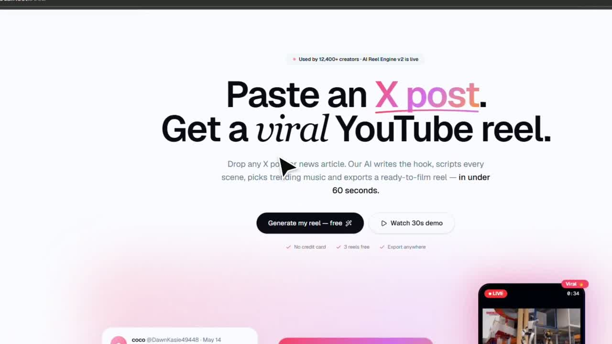
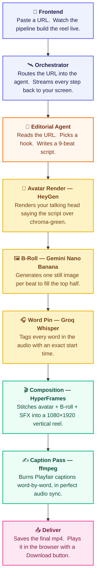

# Phantom — Autonomous Reel Producer

> Paste an X post or news article URL → autonomous AI agent ingests it, writes a 9-beat script, renders an avatar, generates B-roll, composes a 1080×1920 vertical reel, burns word-pinned captions, and gives you a downloadable mp4.

<p align="center">
  <strong>Built for the <a href="https://heygen.com">HeyGen Hackathon</a> · May 14–15, 2026 · Agent Track</strong><br>
  Local-only. Clone, run, paste a URL, get a reel.
</p>

<p align="center">
  <a href="#overview">Overview</a> ·
  <a href="#architecture">Architecture</a> ·
  <a href="#inspiration">Inspiration</a> ·
  <a href="#mechanics">Mechanics</a> ·
  <a href="#tools--tech-stack">Tools</a> ·
  <a href="#prerequisites">Prerequisites</a> ·
  <a href="#quick-start">Quick Start</a> ·
  <a href="#limitations">Limitations</a>
</p>

---

## Demo

[](https://github.com/divygoyal/phantom/raw/master/public/walkthrough.mp4)

**Click the thumbnail above** for the 75-second walkthrough — paste an X URL, watch the 8-stage pipeline animate, download the finished reel.

<sub>(Also embeds inline on platforms that support HTML5 video:)</sub>

<video src="https://github.com/divygoyal/phantom/raw/master/public/walkthrough.mp4" controls width="100%"></video>

---

## Overview

Phantom is a **single-feature product**: paste an X post or news article URL, get back a finished 9:16 vertical reel.

That's the entire surface area. No editing UI. No timeline scrubber. No "let me suggest a caption" copilot. You hand it a link, it hands you back an mp4 ready to drop into Instagram Reels, TikTok, or YouTube Shorts.

Under the hood it's an autonomous AI agent: it reads the source, picks a hook archetype, drafts a 9-beat script in [@AISimplifiedu](https://www.youtube.com/@AISimplifiedu)'s editorial voice, renders an avatar speaking that script, generates B-roll per beat, composes the layout, burns word-pinned captions, mobile-encodes, and stages the file. End to end, a run is **15–30 minutes**.

The agent has **zero hardcoded editorial**. Two URLs produce two genuinely different reels — different tones, different hook archetypes, different SFX, different visual rhythms — because every taste decision is made per URL by the underlying `reel-production` skill.

---

## Architecture



> Every block in plain English: paste → route → write → speak → illustrate → time → stitch → caption → ship.

The orchestrator and the skill subprocess communicate via **the filesystem**. Every run leaves a slug folder on disk with the brief, script, plan, critique log, SFX cues, Whisper pin, and intermediate mp4s — easy to debug, easy to reproduce.

---

## Inspiration

- 📺 **Channel we're building this for:** [@AISimplifiedu](https://www.youtube.com/@AISimplifiedu) — a creator-built YouTube channel covering AI news entirely through 9:16 reels.
- 🧠 **Editorial voice we're encoding:** [@VarunMayya](https://www.youtube.com/@VarunMayya) — punchy hooks, plain-spoken pacing, structure that survives the first 2 seconds.

Every reel on [@AISimplifiedu](https://www.youtube.com/@AISimplifiedu) used to take **4–6 hours** of manual work: pick a topic from the day's noise, write a hook, script every beat in spoken voice, source the B-roll, build the 1080×1920 layout, time the captions to each word, mix the SFX, mobile-encode.

The skill behind Phantom — `reel-production` — was **trained on dozens of viral YouTube reels from creators like [@VarunMayya](https://www.youtube.com/@VarunMayya)** by recognising the common patterns they share: hook archetypes that survive the first 2 seconds, beat structures that hold retention through 60s, caption rhythms that match spoken cadence, SFX choices that punctuate without distracting. Those patterns became rubrics, a 20-signal critique pass, and reference catalogs the agent consults on every URL.

Phantom is the wrapper that exposes that skill as a single web action — paste URL, get reel — without any of the human-in-the-loop steps in between.

The HeyGen Hackathon was the deadline that forced the wrap.

---

## Mechanics

What happens between paste and mp4, by stage. Each row is a real SSE event you'll see flicker by in the UI timeline.

| # | Stage | Tool | Output |
|---|---|---|---|
| 1 | **Delegate to agent** | `spawn claude --print` | subprocess started with the autonomous-mode prompt |
| 2 | **Source ingest + editorial intake** | X syndication API · cheerio · skill Phase 0 | parsed source + 12-field brief: topic class, emotional thesis, audience lean, pacing, hook archetype, tonal palette, share trigger, frame-zero promise |
| 3 | **Script draft + critique pass** | skill Phase 2 → 3 | 9-beat reel script · checked against 20 auto-fail signals (course-bro CTAs, tonal clashes, mech-default repeats, retention misses) · revised up to 3 passes before render gate |
| 4 | **Avatar render** | HeyGen template endpoint | 1080×1920 mp4 of your configured avatar speaking the script · chroma-locked background |
| 5 | **B-roll generation** | Gemini Nano Banana · source-clip cuts | one still per beat + natural in/out cuts from any video found in the source URL |
| 6 | **Composition + render** | HyperFrames · Whisper · ffmpeg | 30fps render · word-pinned avatar audio · SFX dropped on real word boundaries |
| 7 | **Caption pass** | ffmpeg drawtext · Playfair Display Regular | one drawtext per Whisper word · enables from `startSec` to next word's `startSec` (zero-delay, zero-overlap) · 1.3× speed bump |
| 8 | **Stage to frontend** | filesystem copy | `phantom/public/reels/<slug>/final.mp4` |

The whole pipeline is **autonomous** between stages 1 and 8 — no human input between the URL paste and the final mp4. Every editorial decision (tone, hook archetype, structure, image style, motion verb, SFX palette, caption phrasing) is made per URL by the skill's reference catalogs.

**Style pass details.** The caption pass reads the slug's Whisper transcript and emits one ffmpeg drawtext filter per word. Each word is on-screen exactly from its `startSec` to the next word's `startSec` — perfectly word-synced, no fade-out gap, no overlap. The Whisper handle artifact `Jodas iSimplified` is auto-merged into a single visual word `@aisimplified` spanning both word time-ranges. Result feels like the Higgsfield-style word-by-word reels but rendered locally in ffmpeg in ~30 sec on top of the base mp4.

---

## Tools & Tech Stack

| Layer | Tools |
|---|---|
| **Frontend** | Next.js 16 (App Router, Turbopack) · React 19 · Tailwind · shadcn/ui · lucide-react |
| **Backend** | Node.js 22+ · Prisma 6 · SQLite |
| **Agent runtime** | Claude Code CLI (`claude --print`) · `reel-production` skill |
| **AI services** | HeyGen API (template render endpoint, avatar video) · ElevenLabs (voice cloning — your voice is cloned once on ElevenLabs and imported into HeyGen) · Gemini Nano Banana (B-roll stills) · Groq Whisper-large-v3 (word-level audio transcription) |
| **Composition** | **HyperFrames** — our HTML-based composition layer that builds 1080×1920 vertical layouts (the skill renders frames straight from HyperFrames; no third-party motion-graphics framework) |
| **Encoding** | ffmpeg · libx264 · AAC · chroma-key filter · drawtext caption burn |
| **Fonts** | Playfair Display Regular (Google Fonts) for word-pinned captions |
| **Streaming** | Native Server-Sent Events over HTTP — no websockets, no third-party realtime service |

---

## Prerequisites

| Requirement | Why | How to get it |
|---|---|---|
| **Node 22+, npm 11+** | Next.js 16 + Prisma 6 toolchain | [nodejs.org](https://nodejs.org) |
| **Claude Code CLI** on `PATH` (so `claude --print` works) | Phantom shells out to invoke the skill subprocess | [claude.com/claude-code](https://www.claude.com/product/claude-code) |
| **`reel-production` skill** at `~/.claude/skills/reel-production/` | The editorial brain — viral-pattern rubrics + 20-signal critique pass | **ships in this repo** at `skills/reel-production/` · just copy/symlink it into your `~/.claude/skills/` folder (see Quick Start step 4) |
| **FFmpeg + ffprobe** on `PATH` | Source-clip cuts, chroma-key, caption burn, mobile encode | Windows: `winget install Gyan.FFmpeg` · macOS: `brew install ffmpeg` · Linux: `apt install ffmpeg` |
| **HeyGen API key** | Avatar renders | [app.heygen.com/settings](https://app.heygen.com/settings) → API tab |
| **HeyGen template** (chroma-locked, `{{script}}` text variable) | Required if your avatar is a **photo_avatar** — the direct `v2/video/generate` endpoint silently ignores `background` overrides for photo_avatars, breaking the chroma-key composition step | Create in HeyGen UI: avatar + lock chroma-green BG + add `{{script}}` text var in the script panel · then `GET https://api.heygen.com/v2/templates` to grab the id |
| **Gemini API key** (free) | Nano Banana stills for B-roll beats not covered by the source video | [aistudio.google.com/app/apikey](https://aistudio.google.com/app/apikey) |
| **Groq API key** (free) | Whisper-large-v3 word-level transcription for caption sync | [console.groq.com/keys](https://console.groq.com/keys) |

---

## Quick Start

```bash
# 1. Clone
git clone https://github.com/divygoyal/phantom
cd phantom

# 2. Install
npm install
npx prisma migrate dev --name init

# 3. Configure environment
cp .env.example .env.local
# Edit .env.local — at minimum:
#   HEYGEN_API_KEY=sk_V2_...
#   HEYGEN_TEMPLATE_ID=...           # chroma-locked template with {{script}} var
#   HEYGEN_AVATAR_LOOK_ID=...
#   HEYGEN_VOICE_ID=...
#   GEMINI_API_KEY=AIza...
#   GROQ_API_KEY=gsk_...
#   RUN_VIA_SKILL=true               # delegates the pipeline to the reel-production skill

# 4. Install the reel-production skill so `claude --print` can discover it
#    macOS / Linux:
mkdir -p ~/.claude/skills && cp -r skills/reel-production ~/.claude/skills/
#    Windows (PowerShell):
#    New-Item -ItemType Directory -Force "$env:USERPROFILE\.claude\skills" | Out-Null
#    Copy-Item -Recurse -Force skills/reel-production "$env:USERPROFILE\.claude\skills\"

# 5. Start dev server
npm run dev   # → http://localhost:3000
```

Open **`http://localhost:3000`**, scroll to the *"Paste it. Generate it. Post it."* block, paste an X URL or article URL, click **Generate viral reel**.

The landing page streams SSE from the agent as work happens — animated 8-stage progress, elapsed time, live event/artifact counters. When the run finishes (~15–30 min), the video player loads with a Download mp4 button.

A `/live-run` route exists as a debug view of the same pipeline (timeline-list layout instead of the hero animation).

---

## License + credits

Built by [@devdivygoyal](https://x.com/devdivygoyal) for the HeyGen Hackathon. The `reel-production` skill is the editorial brain — **trained on dozens of viral YouTube reels by recognising the common patterns they share** (hook archetypes, beat structures, caption rhythms, SFX choices), distilled into rubrics + a 20-signal critique pass + reference catalogs. Phantom is the wrapper that exposes it as a one-paste web action.
